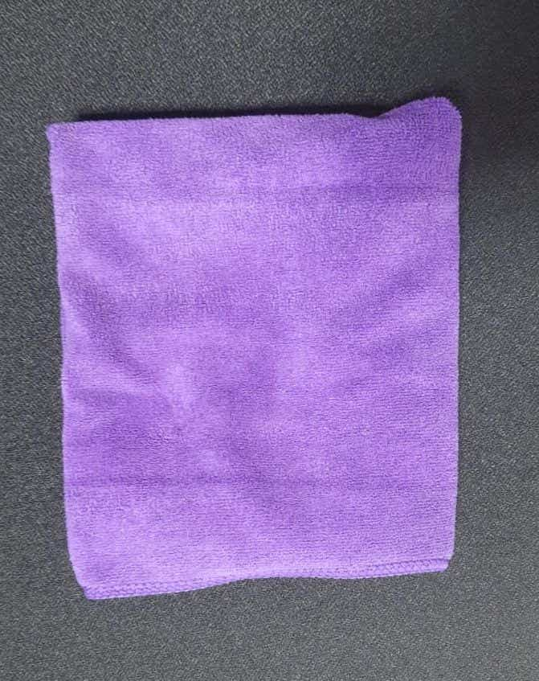

# Plain Cloth Image Dataset (Manual Collection)

This repository contains a manually collected dataset of **soft cloth images** captured in the **plain (spread out)** state across various surfaces and lighting conditions. The dataset serves as a foundation for developing cloth detection and classification systems using computer vision techniques.

---

## 🧩 Dataset Purpose

Cloth state detection is a complex computer vision problem due to cloth deformability, lighting conditions, and surface textures. This project addresses the **early-stage challenges of data scarcity and realism** by collecting actual images of cloth in the **plain state** before transitioning to synthetic data generation.

---

## ⚠️ Project Background

**We were initially awaiting the arrival of a depth camera** to build a more advanced dataset using **Blender-generated synthetic scenes** with accurate 3D information. However, **to begin experimentation early**, we manually collected image data by **clicking photos of soft cloth** in real environments. This allowed us to:

- Begin testing TensorFlow pipelines
- Validate image preprocessing and labeling strategies
- Evaluate surface and lighting variation effects on cloth detection

---

## 📸 Image Details

- **State**: Plain (fully spread, not folded or crumbled)
- **Capture Method**: Mobile phone camera (manual clicking)
- **Environment**: Multiple background surfaces (e.g., textured plastic, fabric, desk)
- **Resolution**: High-quality JPEG images (e.g., 847x671 px)
- **Lighting**: Natural and artificial variations
- **Cloth Material**: Soft microfiber/cotton
- **Color Example**: Purple (example shown below)

### 🖼️ Example Image

---
